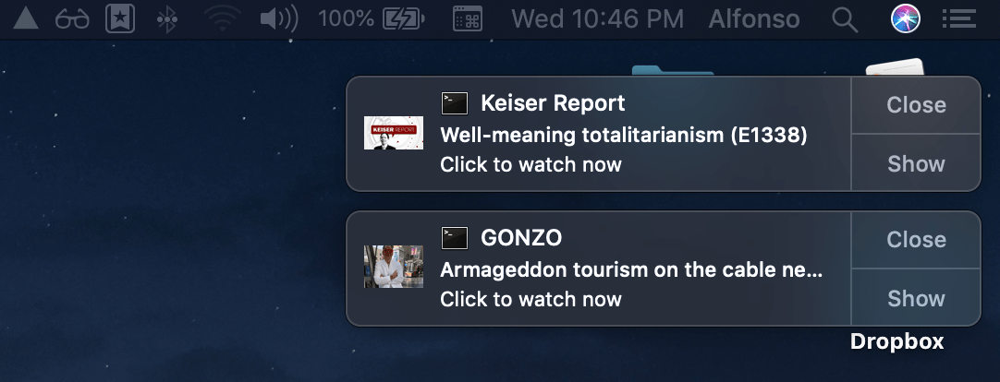

# RT.com shows notifier
> Used modules: **Lowdb**, **Request**, **Cheerio** and **node-notifier**.

Current shows supported:
- Keiser Report
- GONZO

## Usage:

1. Clone the repository and install dependencies:
```
git clone https://github.com/alfonmga/rt-shows-notifier
cd rt-shows-notifier/
npm install
```

2. Run `crontab` editor:
```bash
crontab -e
```

3. Add the cron job (run every 30 minutes):
```
*/30 * * * * /Users/<user>/.nvm/versions/node/v8.10.0/bin/node /Users/<user>/Desktop/crons/rt-shows-notifier/app.js > /Users/<user>/Desktop/crons/rt-shows-notifier/logs/output.log 2> /Users/<user>/Desktop/crons/rt-shows-notifier/logs/error.log
```

## Preview:


