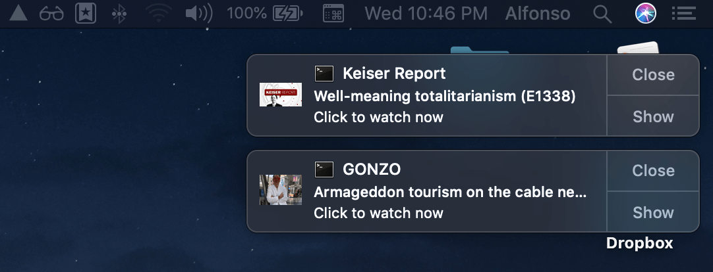

# RT.com shows notifier
> Used modules: **Lowdb**, **Request**, **Cheerio** and **node-notifier**.

Current shows supported:
- [Keiser Report](https://www.rt.com/shows/keiser-report)
- [GONZO](https://www.rt.com/shows/gonzo)

## Usage:

1. Clone the repository and install dependencies:
```
git clone https://github.com/alfonmga/rt-shows-notifier
cd rt-shows-notifier/
npm install
```

2. Run `crontab` editor:
```bash
crontab -e
```

3. Add a cron job to `crontab` (below cron job will run every 30 minutes):
```
*/30 * * * * <path-to-node-bin> <rt-shows-notifier-path-dir>/app.js > <rt-shows-notifier-path-dir>/logs/output.log 2> <rt-shows-notifier-path-dir>/logs/error.log
```

## Preview:



## Why I built this?

That's an easy question, because I love [Max Keiser](https://en.wikipedia.org/wiki/Max_Keiser)'s shows!

<p align="center">
  
</p>

Keiser has advised investors to [buy bitcoin](https://bitcointalk.org/index.php?topic=10949.msg156512#msg156512) and precious metals such as gold and silver, in order to undermine "the banksters" since 2011.
